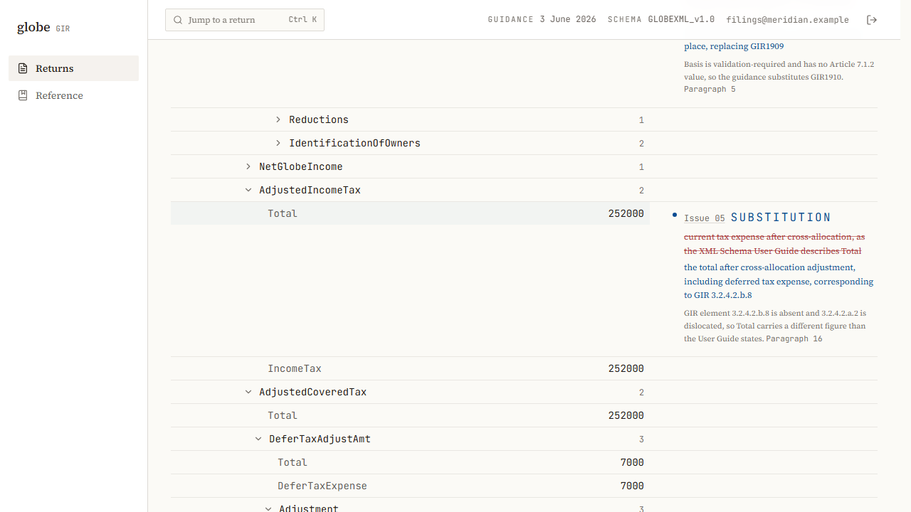
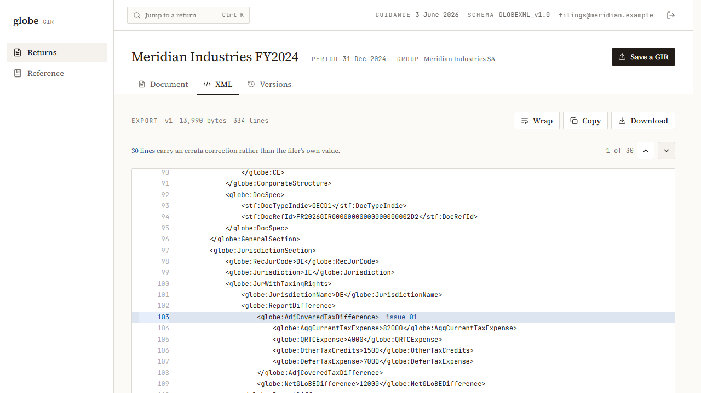
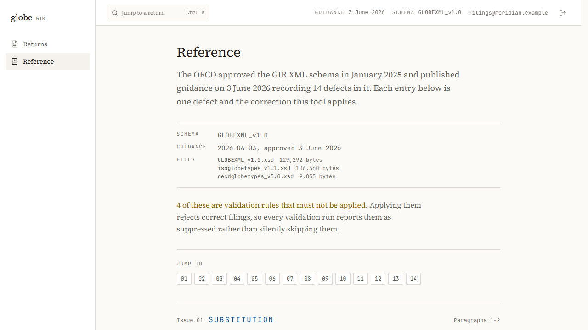

# globe

> Build a GloBE Information Return against a schema the OECD has already documented as broken, and see every correction it needs.

<p align="center">
  
  
  
  
</p>

<p align="center">
  
</p>

Point it at a GIR and it reports what the schema demands, what the June 2026 guidance requires
instead, and which validation rules a receiving authority must not run against the filing. Every
correction is marked against the element it changes and cites the paragraph it comes from.

The fourteen corrections are not string replacements over the XML. The document is parsed into a
tree, each rule addresses a node by a path carrying an ordinal so three jurisdiction sections are
three distinct addresses, and the export is re-serialized from the corrected tree. Two of the rules
turn on four-decimal rounding inside a one percent tolerance, so every rate and money figure is a
decimal rather than a float.

## Why a valid return is not a correct one

The OECD published the GIR XML Schema in January 2025. In June 2026 it published guidance recording
fourteen defects in that schema and the workarounds filers must apply. Ten are corrections to the
document. The other four are validation rules that must not be applied at all, because running them
rejects filings that are correct.

So the schema and the guidance disagree, and a return that satisfies the schema can still be wrong.
This shows both at once rather than silently picking one.

## How it works

1. Save a GIR as the wire XML your own software produced. It is stored as filed and never edited.
2. State the elections that cannot be read off the document. A 7.1.2 and a 7.2.2 election are
   identical once written, and a safe harbour looks like an ordinary computation, so four of the
   corrections apply only when you say so.
3. Run the engine. It calculates the return, validates it, and applies the fourteen corrections.
4. Read the margin. Each correction sits beside the element it changed, in one of three inks.
5. Export. The XML carries the corrections, with every changed line marked.

## Features

**The redline, against the filer's own document.** Struck-through red is what the schema asks for,
blue is what the guidance writes instead, and a grey line underneath gives the reason and the
paragraph. The document keeps the filer's original figures; corrections are applied on top of it,
never to it.

<p align="center">
  
</p>

**The four disapplied rules, on every run.** Rules 60025, 60026, 70092 and 70028 are reported as
suppressed rather than quietly skipped, on a clean return as much as a failing one. A surface that
showed them only alongside errors would render nothing on the path a filer sees most often.

**An export that says which lines it changed.** The XML is re-serialized from the corrected tree,
and the lines carrying a correction are marked and counted. A stepper walks them, so a 334-line
return does not have to be read in full to find the 30 lines that differ.

<p align="center">
  
</p>

**Every defect, with its citation.** The reference lists all fourteen, each with its kind, its
paragraph range, and what the correction does. Annotations in the margin link into it.

<p align="center">
  
</p>

## Versions

| Item | Version |
| --- | --- |
| Schema | `GLOBEXML_v1.0`, target namespace `urn:oecd:ties:globe:v2` |
| ISO types | `isoglobetypes_v1.1` |
| OECD types | `oecdglobetypes_v5.0` |
| Guidance | Approved 3 June 2026, OECD/G20 Inclusive Framework on BEPS |

The guidance is first-cycle: its own title covers the first GIR filings and exchanges. A later
schema release may retire some of the fourteen, so the version it targets is stated rather than
implied, and the application prints both in its chrome on every page.

## Tech

| Layer | Choice |
| --- | --- |
| Engine | TypeScript, standalone. Parsing, calculation, validation and the fourteen corrections, with no I/O |
| Decimals | `decimal.js` |
| XML | `fast-xml-parser` to read, the engine's own writer to emit |
| Backend | Bun and Hono |
| Database | Postgres with Drizzle |
| Frontend | Next.js and React, TanStack Query |
| Tests | Vitest and Playwright |

## Notes on the stack

**The engine imports nothing from the server or the app.** It takes a document and returns a
document, so its behaviour is testable by plain numeric assertion rather than through a request. It
is also the part that would outlive either of the other two.

**Floats are disqualified, not merely discouraged.** Rules 60026 and 70092 fail specifically on
four-decimal rounding inside a one percent tolerance. A rate held as a float cannot express the
difference between `0.1000` and `0.1`, and those are different filings.

**Conformance runs through libxml2, not through a check written here.** A hand-rolled XSD validator
would be written from the same reading of the schema that produced the serializer, so it would agree
with the serializer's own mistakes. The tests shell out to libxml2 through lxml so that it can
disagree. It is a test-time tool: a filing must not fail to save because an interpreter is missing.

**Corrections are addressed by path, not by search-and-replace.** Each rule names a node with an
ordinal on any repeated segment, so a document with three jurisdiction sections gets three distinct
corrections rather than one applied three times or once to the wrong section.

## Requirements

- [Bun](https://bun.sh) 1.3 or newer
- PostgreSQL 16 or newer
- Python with `lxml`, for the XSD conformance tests only

## Setup

The engine is standalone and needs no database:

```bash
cd engine
bun install
bun run test
```

The API needs a database. Copy `backend/.env.example` to `backend/.env`, set `DATABASE_URL` and a
`SESSION_SECRET` of at least 32 characters, then:

```bash
cd backend
bun install
bun run db:migrate
bun run dev
```

Then the app. It looks for the API at `http://localhost:3001` unless `NEXT_PUBLIC_API_URL` says
otherwise:

```bash
cd frontend
npm install
npm run dev
```

There is no sign-up screen. Create the account against the running API:

```bash
curl -X POST http://localhost:3001/api/auth/register -H "Content-Type: application/json" -d "{\"email\":\"you@example.com\",\"password\":\"a-long-passphrase\"}"
```

## Layout

```
engine/     GIR logic: parsing, calculation, validation, the fourteen corrections. No I/O
backend/    Bun and Hono API
frontend/   Next.js app
```

## Checks

The backend suite runs against a real database rather than a mock, and clears every table between
tests, so point `TEST_DATABASE_URL` at a scratch one.

```bash
cd engine && bun run test
cd backend && bun run test
cd frontend && npm run test
```

The end-to-end suite drives a real browser at desktop and mobile widths, against a running stack
rather than one it starts itself:

```bash
cd frontend && npx playwright test
```
